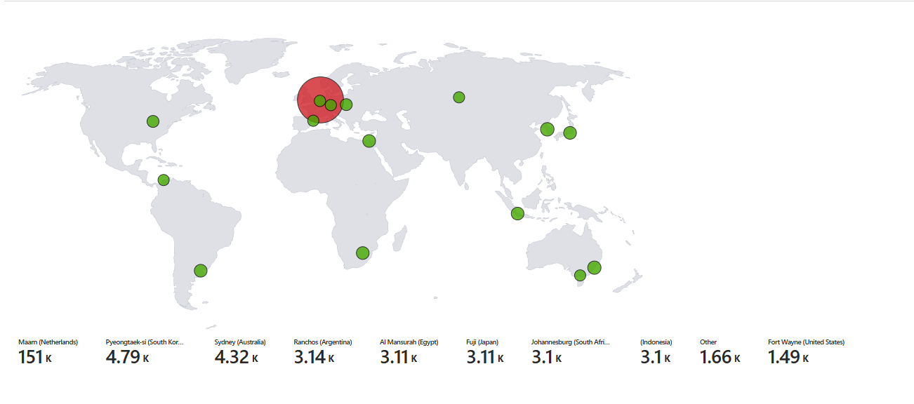
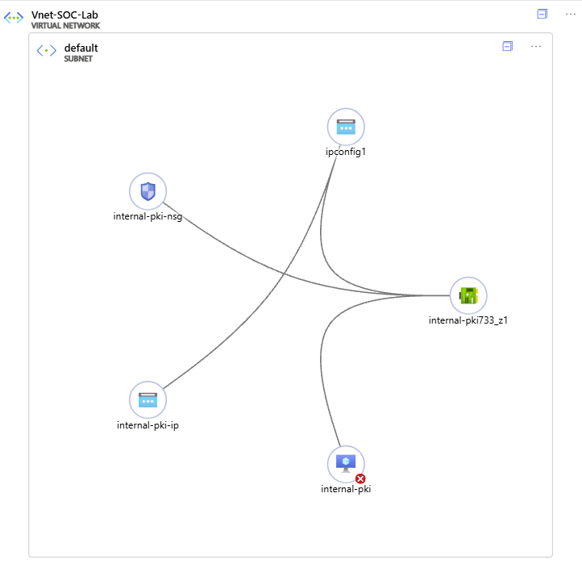

# 🛡️ Azure Honeypot & SIEM Threat Map Lab

This project simulates real-world attack scenarios in a secure virtual network environment, using Azure resources such as virtual machines, network security groups, and log analytics workspaces. Brute-force attempts against exposed services (e.g., SSH or RDP) are monitored using Azure Defender and Sentinel. Detected threats are analyzed and visualized through dynamic workbooks and custom dashboards powered by KQL. Firewall rules and VNET topology are documented, and a live attack map provides a clear view of malicious activity across regions. This lab demonstrates real-time detection, correlation, and response capabilities for enterprise-grade security operations.

## Demo

---

## Tools & Technologies

- Microsoft Azure (Virtual Machines, Networking)
- Log Analytics Workspace (LAW)
- Microsoft Sentinel (SIEM)
- Kusto Query Language (KQL)
- GeoIP Watchlists (IP Enrichment)
- Sentinel Workbooks 

---

##  Virtual Machines

- **Windows 10 VM (`internal-pki`)**: Acts as the honeypot, exposed to public traffic to simulate brute-force attacks.  
- **NSG (`internal-pki-nsg`)**: Network Security Group used to open up all inbound traffic for monitoring.  
- **Public IP (`internal-pki-ip`)**: Linked to the VM for full external access.  
- **NIC (`internal-pki733_z1`)**: Network Interface Card used for routing and traffic handling.  
- **ipconfig1**: Network interface configuration attached to the NIC.  

These machines are all deployed within the **`Vnet-SOC-Lab`** virtual network under the default subnet.

### Visual Topology

The following diagram shows the connection between the VM, IP, NSG, and NIC within the Azure virtual network:

> This topology simulates a real-world cloud-based SOC lab where a vulnerable endpoint (the honeypot VM) can be observed, logged, and analyzed through Microsoft Sentinel.
