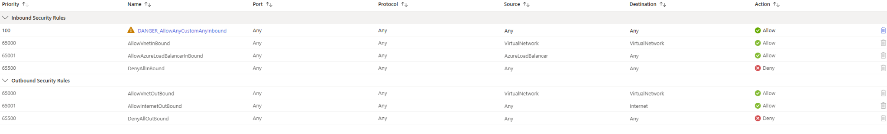

# ⚙️ Setup Guide

## ☁️ 1. Azure Resource Deployment

### 🌐 Virtual Network Topology

The lab is deployed within a single Virtual Network and default subnet. The diagram below illustrates how the core resources are interconnected:

- `internal-pki`: The honeypot VM
- `internal-pki-nsg`: The network security group controlling traffic
- `internal-pki-ip`: The public IP address attached
- `internal-pki733_z1`: The NIC (network interface) for the VM
- `ipconfig1`: Interface configuration

This topology reflects a simplified enterprise layout to demonstrate inbound access and network segmentation.

- Create a subscription and resource group
- Set up a Virtual Network and Subnet
- Deploy a Windows 10 VM

## 🔓 2. Simulate Vulnerable Host

### 🧱 NSG Firewall Rule Configuration

To simulate an exposed machine, the following **Inbound NSG rule** was added to allow any source, destination, port, and protocol:

> 🔥 The rule `DANGER_AllowAnyCustomAnyInbound` with the highest priority (100) opens up the VM to the internet. This was intentional to attract brute-force login attempts.

This is combined with disabling the Windows firewall inside the VM, creating a high-risk, observable attack surface.

- Open all inbound traffic on NSG
- Disable Windows firewall from within the VM
- Attempt failed logins to generate Event ID 4625

## 📊 3. Logging & Sentinel Integration
- Create Log Analytics Workspace (LAW)
- Install Azure Monitor Agent on the VM
- Connect Sentinel to LAW
- Enable "Windows Security Events via AMA"

## 🌍 4. GeoIP Watchlist & Attack Map
- Upload `geoip-summarized.csv` as a Sentinel Watchlist
- Use KQL to enrich IP data with geographic info
- Build an interactive attack map in Sentinel Workbook
